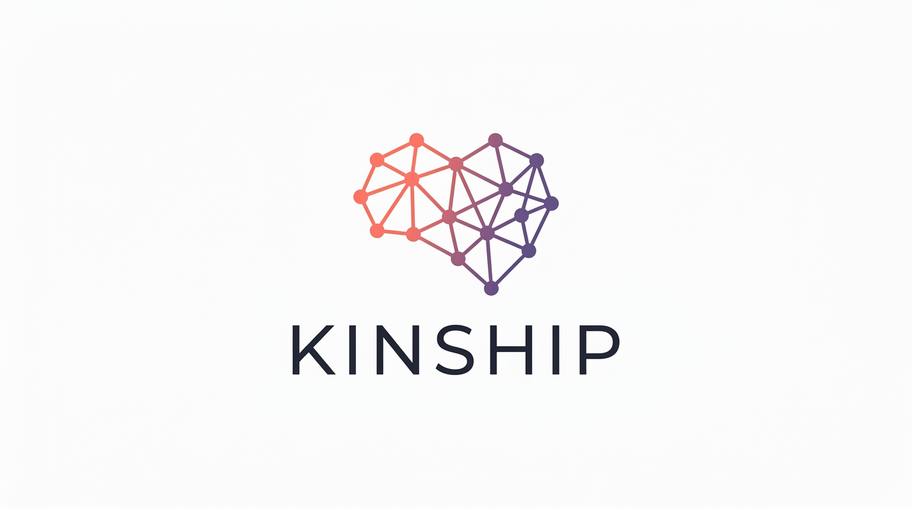

<p align="center">
  
</p>

<h1 align="center">Kinship</h1>

<p align="center">
  <strong>Relationship Intelligence Platform</strong>
</p>

[](https://opensource.org/licenses/MIT)
[](CONTRIBUTING.md)

An open-source relationship intelligence platform that goes beyond contact management. Kinship models the full complexity of human relationships — directionality, context, history, strength, and network effects — with AI-native semantic search and graph visualization.

## Features

- 🔍 **Semantic Search** — Find contacts by meaning, not just keywords ("who works in renewable energy?")
- 🕸️ **Network Graph** — Visualize your relationships and connection paths
- 🌡️ **Warmth Tiers** — Track relationship strength from stranger to inner circle
- 📝 **Interaction History** — Log calls, meetings, emails, messages
- ⏰ **Decay Detection** — Get alerts when relationships need attention
- 🏢 **Organization Tracking** — Map people to companies with roles

## Quick Start

### Prerequisites

- Node.js 18+
- pnpm
- [Supabase](https://supabase.com) account
- [Google AI](https://ai.google.dev) API key (for embeddings)

### Installation

```bash
# Clone the repo
git clone https://github.com/zenpierce27/kinship.git
cd kinship

# Install dependencies
pnpm install

# Set up environment
export KINSHIP_SUPABASE_URL="https://your-project.supabase.co"
export KINSHIP_SUPABASE_ANON_KEY="your-anon-key"
export KINSHIP_SUPABASE_SERVICE_KEY="your-service-key"
export GEMINI_API_KEY="your-gemini-key"
```

### Database Setup

1. Create a new Supabase project
2. Enable the `vector` extension in SQL Editor:
   ```sql
   CREATE EXTENSION IF NOT EXISTS vector;
   ```
3. Run the migration in `supabase/migrations/20260329_001_initial_schema.sql`

### CLI Usage

```bash
cd packages/cli

# Add a contact
npx tsx src/index.ts add "Sarah Chen" \
  --email "sarah@example.com" \
  --company "Acme Inc" \
  --tier friend \
  --met "Met at tech conference"

# List contacts
npx tsx src/index.ts list
npx tsx src/index.ts list --tier friend
npx tsx src/index.ts list --company "Acme"

# Log an interaction
npx tsx src/index.ts log "Discussed partnership" \
  --person "Sarah Chen" \
  --type meeting

# Semantic search
npx tsx src/index.ts search "who knows about machine learning?"

# Check for decaying relationships
npx tsx src/index.ts decay --dry-run
```

### Web UI

```bash
cd packages/web

# Create .env.local
echo "NEXT_PUBLIC_SUPABASE_URL=https://your-project.supabase.co" > .env.local
echo "NEXT_PUBLIC_SUPABASE_ANON_KEY=your-anon-key" >> .env.local

# Run development server
pnpm dev
# Open http://localhost:3456
```

## Architecture

```
kinship/
├── packages/
│   ├── cli/              # TypeScript CLI
│   │   ├── commands/     # add, list, log, search, decay
│   │   └── lib/          # Supabase client, embeddings
│   └── web/              # Next.js web app
│       └── src/
│           ├── app/      # Pages (list, detail, add)
│           └── components/
├── supabase/
│   └── migrations/       # Database schema
└── docs/                 # Documentation
```

## Warmth Tiers

| Tier | Description | Decay Period |
|------|-------------|--------------|
| `inner_circle` | Close collaborators, daily contact | 30 days |
| `close_friend` | Regular contact, high trust | 60 days |
| `friend` | Frequent contact, good relationship | 90 days |
| `colleague` | Work relationship, occasional contact | 120 days |
| `contact` | Business connection, infrequent | 180 days |
| `acquaintance` | Met once, minimal relationship | 365 days |

## Roadmap

- [ ] **Import Sources** — LinkedIn, Google Contacts, CSV
- [ ] **Mobile App** — React Native wrapper
- [ ] **Reminders** — "Reach out to X" notifications
- [ ] **Network Analysis** — Clustering, influence mapping
- [ ] **AI Summaries** — "What do I know about this person?"

## Contributing

Contributions are welcome! See [CONTRIBUTING.md](CONTRIBUTING.md) for guidelines.

## License

[MIT](LICENSE)

---

Built with ❤️ for meaningful connections.
